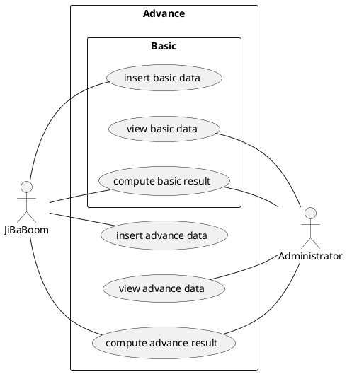
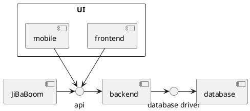
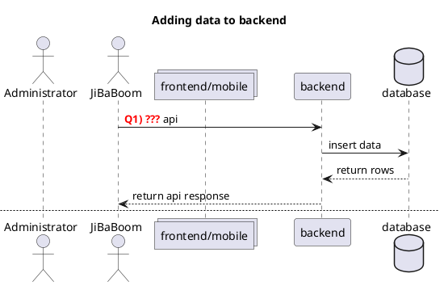

> For this worksheet, you'll need plantuml to view the diagram

# Project Worksheet

This document aims to provide you with a better understanding of the structure/flow of the project.

## Use Case

Recall that there are a few functionality requried from this system


Link: [Use Case Diagram](https://www.plantuml.com/plantuml/svg/0/RP5D4e8m38NtFKMMik0EY3jl4Kh4ED0wRS25mzrjeVoEsULxBydhjF22JlgkLIqz1CI2u-OfKBCZBMoDGYtMmPrBBAtj03sygYhHQzsnOIyEOnSaZ435KJHDIy4meD44NmMXDbwYPvrehB0IyXmkR3mvWMgIQnJCLijbOFhibJWmtrijsdRlNYYv7Fc-bIpcIiBvtXaly-lcIHdLduYONhQ5d0CU-37Y6c_nx086TDk5ISTET6ktnQCgoDJX0ty0 "project_worksheet")

### Question

The above listed are functional requirements, that is, **WHAT** the system should allow users to do. There are also non-functional requirements that state **HOW** a system should perform.

-   Q1. Consider the use case of `Compute basic/advance result`, **HOW** is this functionality made available to both JiBaBoom and Adminstrator _(Hint: They are different)_? `(Answer Here)  JiBaBoom inserts basic and advance data while Administrator views basic and advance data. Both of them are able to compute basic/advance result as they both have access to the basic and advance data.`
-   Q2. Consider the use case of `Insert basic/advance data`. **HOW** is the data stored? `(Answer Here) The data is firstly inserted into the database by JiBaBoom by using the INSERT API. Then, it is stored in their respective databases - basic data is stored in basic database and advance data is stored in advance database. When JiBaBoom inserts data, the database stores it and Administrator views the compiled data. `

---

## Components

Recall that there are 3 or 4 components required

-   Frontend
-   Backend
-   Database
-   Mobile (For ADES students)

And in addition, **JiBaBoom**, the company you're developing for will also use your system.

Below is how they are connected with each other, and the means which they are connected.


Link: [Component Diagram](https://www.plantuml.com/plantuml/svg/0/JK-x3i8m3Dpz5LRt_WAgki7EL6LmOhT4j0boGXV4lnCUJR5aoRxJdSzTogJvlioWuZA5QHOy7_41M6eODOOiWSrtNQBrinXu0e0lX8xa11kcJ9QI8AjVHHkaXCmmd7nFVOoBmLRzTCdj0UdceVGE39RSzNEXJZlvDgaHiFtfjnWLOFxpsy8Ow8ggFFO2 "project_worksheet-1")


### Questions:

1. Does the frontend communicate with the mobile? `(Yes/No) No`
2. Does the frontend communicate directly with the database? `(Yes/No) No`
3. How should the frontend display data from the database? `(Answer here) HTTP. HTTP contains the request which is then sent to the backend to process. The backend has APIs such as GET to literally "get" the data from the database. Once the data is received, the backend will send it to the frontend which will display the data on the website. `
4. How does the frontend communicate with backend? `(Answer here) The frontend and backend communicate using APIs such as GET and POST. The HTTP request contains the query which the backend is supposed to process. The frontend then sends the query to the backend by using APIs and the backend returns the result of the query to the frontend which displays it on the website.`

---

## Sequence of event

Recall that the following are the required features:

1. Frontend/Mobile
    1. Data Viewer - To view data stored in the database
    2. Result Viewer - To view result based on data stored in the database and some computation input.
2. Backend
    1. Insert API - To insert data into the database
    2. Result API - to view result based on data stored in the database and some computation input.

Below is a diagram to illustrate the sequence of event and how the different features will trigger communications among the different components.


Links:
- [Adding data to backend(Q1)](https://www.plantuml.com/plantuml/svg/0/nLHDIyD04BtlhnXwKoZYrwNKf1OH4Oi8uidB9fdMqMGtxCwQl-ziqxIr1Ypru6qpR_RDUxEFJ3nhnw4g5HEN2DT5GMO1XMODR27J-GUQGkcShHEm8aEUdOvVseEEXHLuJrCzjRQAzVSiKxajIyoPhF4mc3jhM8XEAfjHYOFO54ZLCfjoghNXzQWuEjCU0RgJKi87mwHh6S4uIyPpOGGPOjsLmo9vEZs2D4t79ra2kYQrwetNEfuHaF7eU5dOp1bkCplau0mus_WDXJI8WZKez7BqjJWJRGQRMYyGNWYRzUh4RmKxffLQhYig2jJluMpZuLFeqAb0tumli5L_h8nbX1BdF88tsq2kpUwyLzDrjt9M96d_QZp6rpfaDT5CtsPQwH4DjJ0Yt3tF7k3cSRP416hJysE1GX1ARZLteTel0kTxHE10drjuRgiwY9rMvu4fsJPvsxtRRD-SNFoMaxvBb_-zdJy6PI8yygFw0W00 "Adding data to backend")
- [Viewing data from frontend/mobile(Q2)](https://www.plantuml.com/plantuml/svg/1/nLHDIyD04BtlhnXwKoZYrwNKf1OH4Oi8uidB9fdMqMGtxCwQl-ziqxIr1Ypru6qpR_RDUxEFJ3nhnw4g5HEN2DT5GMO1XMODR27J-GUQGkcShHEm8aEUdOvVseEEXHLuJrCzjRQAzVSiKxajIyoPhF4mc3jhM8XEAfjHYOFO54ZLCfjoghNXzQWuEjCU0RgJKi87mwHh6S4uIyPpOGGPOjsLmo9vEZs2D4t79ra2kYQrwetNEfuHaF7eU5dOp1bkCplau0mus_WDXJI8WZKez7BqjJWJRGQRMYyGNWYRzUh4RmKxffLQhYig2jJluMpZuLFeqAb0tumli5L_h8nbX1BdF88tsq2kpUwyLzDrjt9M96d_QZp6rpfaDT5CtsPQwH4DjJ0Yt3tF7k3cSRP416hJysE1GX1ARZLteTel0kTxHE10drjuRgiwY9rMvu4fsJPvsxtRRD-SNFoMaxvBb_-zdJy6PI8yygFw0W00 "Adding data to backend")
- [Viewing result from JiBaBoom(Q3)](https://www.plantuml.com/plantuml/svg/2/nLHDIyD04BtlhnXwKoZYrwNKf1OH4Oi8uidB9fdMqMGtxCwQl-ziqxIr1Ypru6qpR_RDUxEFJ3nhnw4g5HEN2DT5GMO1XMODR27J-GUQGkcShHEm8aEUdOvVseEEXHLuJrCzjRQAzVSiKxajIyoPhF4mc3jhM8XEAfjHYOFO54ZLCfjoghNXzQWuEjCU0RgJKi87mwHh6S4uIyPpOGGPOjsLmo9vEZs2D4t79ra2kYQrwetNEfuHaF7eU5dOp1bkCplau0mus_WDXJI8WZKez7BqjJWJRGQRMYyGNWYRzUh4RmKxffLQhYig2jJluMpZuLFeqAb0tumli5L_h8nbX1BdF88tsq2kpUwyLzDrjt9M96d_QZp6rpfaDT5CtsPQwH4DjJ0Yt3tF7k3cSRP416hJysE1GX1ARZLteTel0kTxHE10drjuRgiwY9rMvu4fsJPvsxtRRD-SNFoMaxvBb_-zdJy6PI8yygFw0W00 "Adding data to backend")
- [Viewing result from Frontend/Mobile(Q4 & Q5)](https://www.plantuml.com/plantuml/svg/3/nLHDIyD04BtlhnXwKoZYrwNKf1OH4Oi8uidB9fdMqMGtxCwQl-ziqxIr1Ypru6qpR_RDUxEFJ3nhnw4g5HEN2DT5GMO1XMODR27J-GUQGkcShHEm8aEUdOvVseEEXHLuJrCzjRQAzVSiKxajIyoPhF4mc3jhM8XEAfjHYOFO54ZLCfjoghNXzQWuEjCU0RgJKi87mwHh6S4uIyPpOGGPOjsLmo9vEZs2D4t79ra2kYQrwetNEfuHaF7eU5dOp1bkCplau0mus_WDXJI8WZKez7BqjJWJRGQRMYyGNWYRzUh4RmKxffLQhYig2jJluMpZuLFeqAb0tumli5L_h8nbX1BdF88tsq2kpUwyLzDrjt9M96d_QZp6rpfaDT5CtsPQwH4DjJ0Yt3tF7k3cSRP416hJysE1GX1ARZLteTel0kTxHE10drjuRgiwY9rMvu4fsJPvsxtRRD-SNFoMaxvBb_-zdJy6PI8yygFw0W00 "Adding data to backend")

### Questions:

Choose the correct API/Viewer to be used for each of the `???` steps in the diagram:

-   Q1. `[Insert/Result] Insert` API (Delete one of the options)
-   Q2. `[Data/Result] Data` Viewer
-   Q3. `[Insert/Result] Result` API
-   Q4. `[Data/Result] Result` Viewer
-   Q5. `[Insert/Result] Result` API

There's a note that mentions

```
how can frontend/mobile\nget data from backend?
```

Think about how you can do it and type your answer below:

```
[Answer Here]
Access to the API from the JavaScript frontend is done through the HTTP protocol. In the case of a web application, the API returns JSON, a specific data format to transfer specific information. Pushing data to the API will also be usually done with JSON.

```

---
